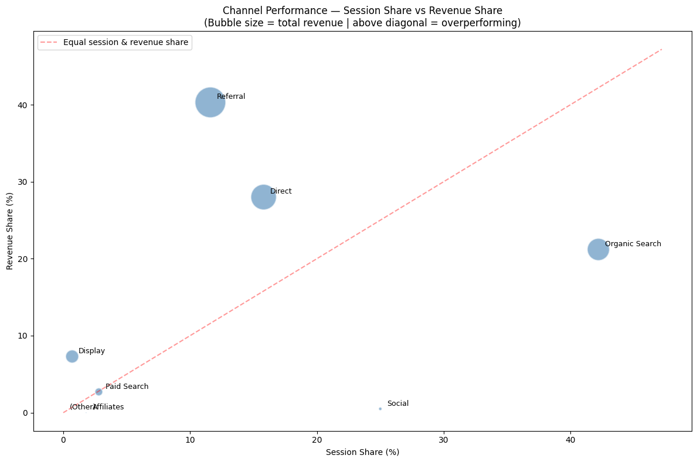
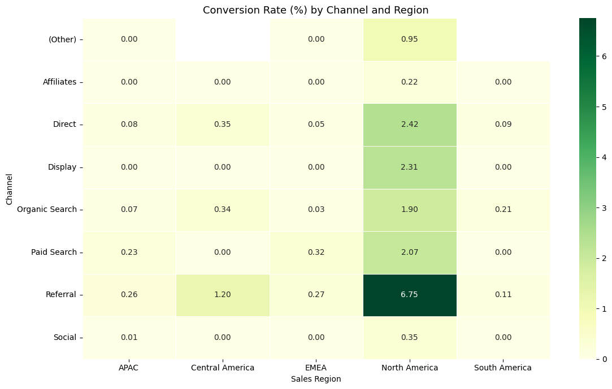
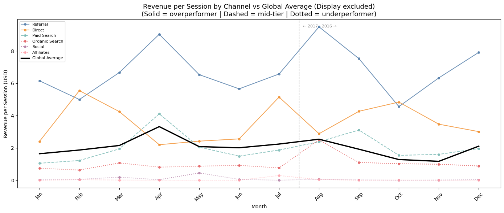

# Google Merchandise Store — Marketing Channel Analysis

A Python-based exploratory data analysis of the Google Merchandise Store, examining 
which marketing channels drive the most valuable sessions and how performance varies 
seasonally. The analysis is framed as a recommendation to the store's CMO.

**Tools:** Python, pandas, matplotlib, seaborn, Google BigQuery, Google Colab  
**Data:** GA360 sample dataset via Google BigQuery — 903,653 sessions, August 2016 to August 2017  
**Notebook:** [View on Kaggle](#) *(link to be added)*

---

## Key Findings & Recommendations

- **Referral is the standout channel** — 5.08% conversion rate and 40.3% of total 
revenue from just 11.6% of sessions. Protect and invest in Referral — its performance 
is tied to external sources requiring active relationship management.
- **Social is the most significant misallocation** — 25% of sessions but only 0.5% of 
revenue, with no seasonal window where performance improves. Redirect efforts away 
from Social and Affiliates entirely.
- **Non-North American traffic is structurally non-converting** — EMEA contributes 
170,000 sessions at 0.04% conversion, pointing to a shipping or payment barrier. 
Converting even 1% of EMEA sessions would add ~1,700 transactions annually — the 
highest-leverage opportunity in this analysis.
- **Q2 is the strategic peak** — conversion rates peak in April–June, aligned with 
Google I/O, while session volume is not at its highest. Concentrate efforts in Q2 and 
Q3; within Q4 only December justifies investment.
- **Display is a hidden overperformer** — smallest channel by volume but second highest 
conversion rate and highest median order value. A statistically significant April 
revenue event (p=0.0000, permutation test) suggests high-value B2B purchasing aligned 
with Google I/O — worth monitoring and potentially scaling.

---

## Screenshots

### Channel Performance Overview


### Regional Conversion Heatmap


### Revenue per Session by Channel Over Time


---

## Notebook Structure

| Section | Description |
|---|---|
| Business Context | The store, its audience and the core business question |
| Executive Summary | Key findings and recommendations |
| Introduction | Analytical approach and dataset notes |
| 1. Setup | Library imports and BigQuery connection |
| 2. Dataset & Data Extraction | Schema, extraction approach and field selection |
| 3. Data Quality Assessment | Data types, nulls, unique values and anomaly investigation |
| 4. Data Cleaning | Dropping unusable fields, handling missing values, type conversions |
| 5.1 Revenue Drivers | Regression identifying session-level variables that explain revenue |
| 5.2 New vs Returning Visitors | Visitor value, channel loyalty and retention |
| 5.3 Channel Performance | Session volume, conversion, revenue efficiency and regional breakdown |
| 5.4 Temporal Patterns | Seasonal patterns in revenue and conversion by channel |

---

## How to Run

The notebook is designed to run in **Google Colab**, which handles BigQuery 
authentication natively. To run it yourself:

1. Open the notebook in Google Colab
2. Set up a [Google Cloud account](https://cloud.google.com) with a project enabled 
— BigQuery is a service within Google Cloud and the query volume falls within the 
free monthly tier
3. Replace the project ID in the Setup cell with your own
4. Run all cells — authentication is handled via Colab's built-in auth helper

The dataset is publicly available:
`bigquery-public-data.google_analytics_sample.ga_sessions_*`

The notebook can also be run locally with the BigQuery Python client installed and 
a service account key configured, or on Kaggle where the dataset is available without 
BigQuery authentication.

---

## Repository Structure
```
google-merch-store-eda/
├── README.md
├── notebooks/
│   └── google_merch_store_eda.ipynb
└── screenshots/
    ├── channel_performance_bubble.png
    ├── regional_heatmap.png
    └── revenue_per_session.png
```
